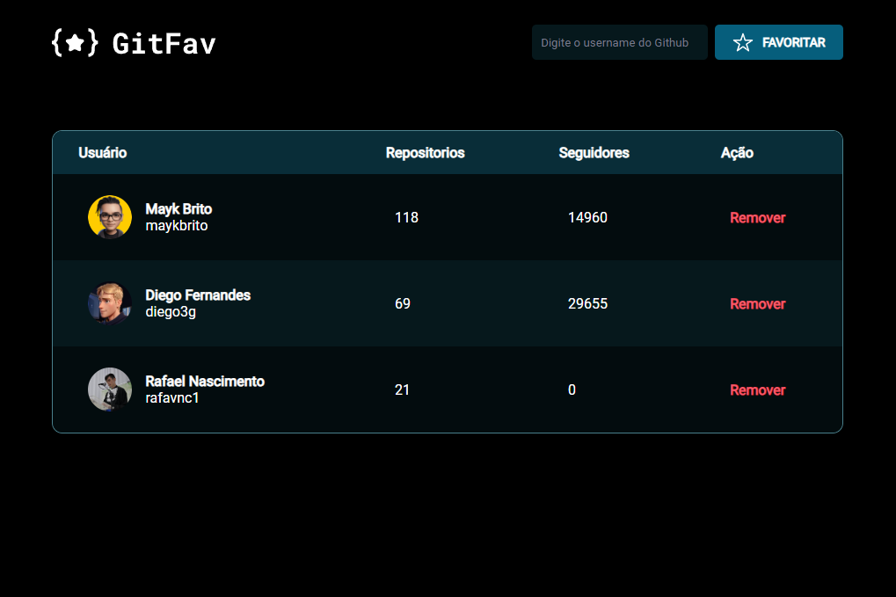
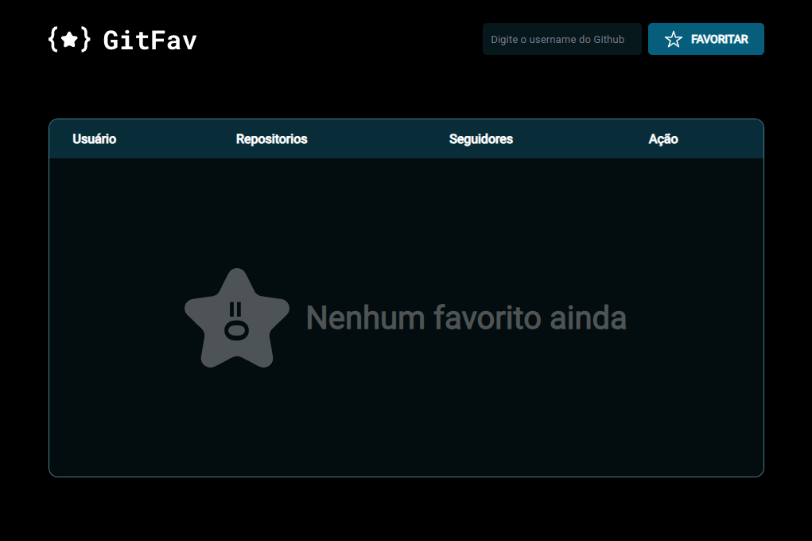

# GitFavorites

## Sobre o projeto / About the project

Neste projeto foi criado uma página com o objetivo de adicionar ou remover perfis favoritos do GitHub usando uma API do GitHub.

In this project, a page was created with the aim of adding or removing favorite GitHub profiles using a GitHub API.

## Layout
#### Tela com favoritos adicionados / Screen with favorites added

## Tecnologias utilizadas / Tech stack
- HTML
- CSS
- JavaScript
- Figma

## Licença / License

### Autor

